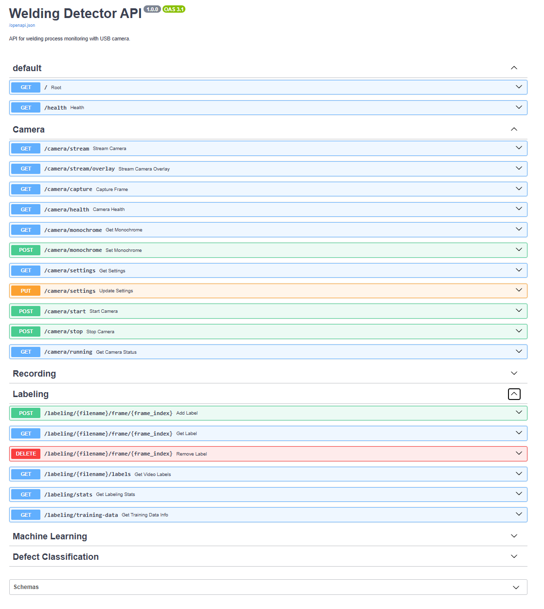
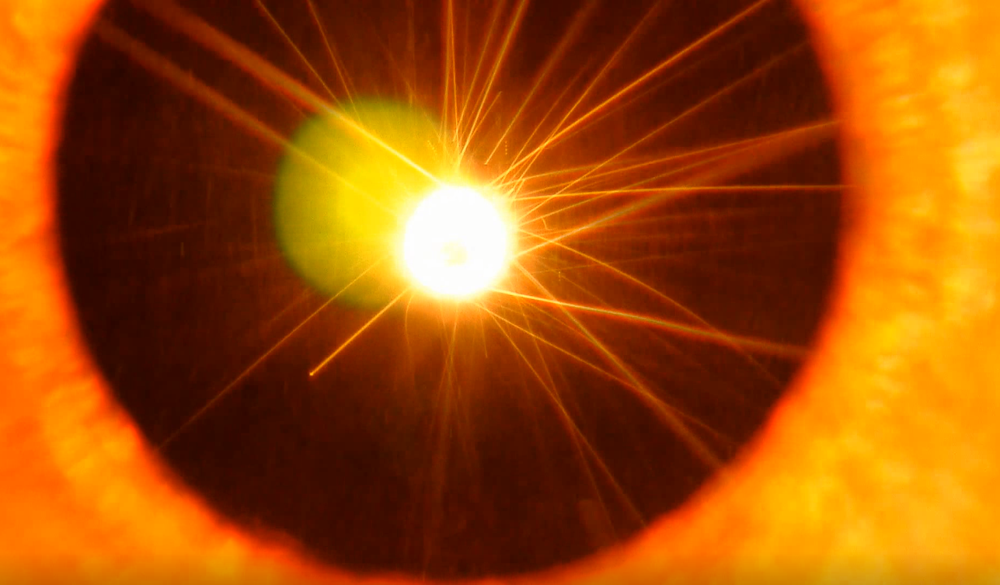
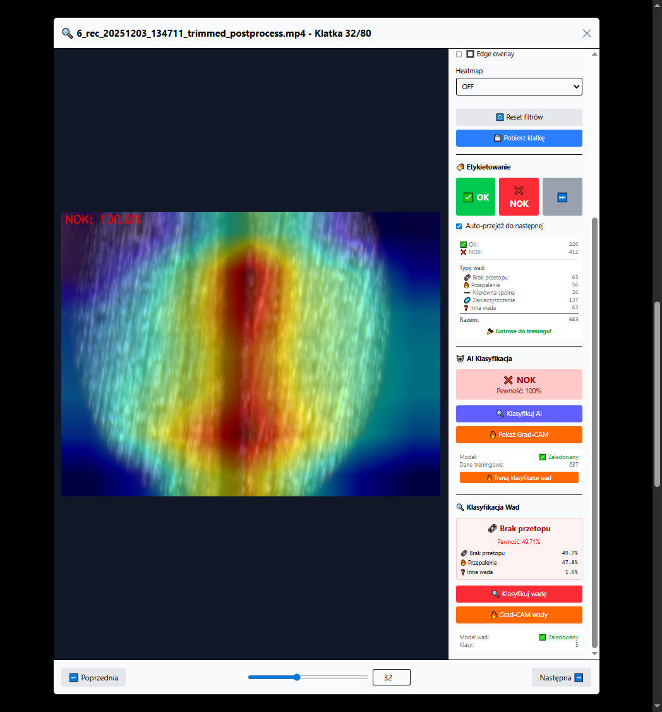
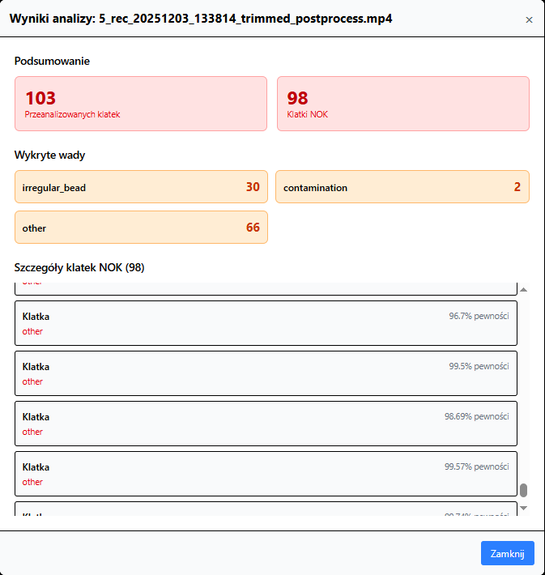

# System Detekcji Wad Spawalniczych

## Przegląd Projektu

Projekt stanowi system inspekcji jakości spawania w czasie rzeczywistym, zbudowany w FastAPI, zaprojektowany do wykrywania i klasyfikacji wad spawalniczych z wykorzystaniem wizji komputerowej i deep learning. System zapewnia automatyczną analizę wideo, detekcję wad klatka po klatce oraz kompleksową klasyfikację dziewięciu różnych typów wad spawalniczych.

Aplikacja rozwiązuje problem ręcznej inspekcji spawów, która jest czasochłonna, subiektywna i podatna na błędy ludzkie. Wykorzystując konwolucyjne sieci neuronowe oraz algorytmy detekcji ruchu, system umożliwia zespołom kontroli jakości efektywną analizę nagrań spawania, identyfikację wad z wysoką precyzją oraz utrzymanie spójnych standardów inspekcji w środowiskach produkcyjnych.

Projekt demonstruje architekturę backendową na poziomie produkcyjnym z naciskiem na skalowalny design serwisów, kompleksowe strategie testowania oraz możliwości przetwarzania wideo w czasie rzeczywistym, odpowiednie dla kontekstów automatyzacji przemysłowej.

## Architektura

Projekt wykorzystuje wzorzec architektury warstwowej z wyraźnym rozdzieleniem odpowiedzialności:

```
app/
├── api/                    # Warstwa Prezentacji
│   ├── routes/            # Definicje endpointów API
│   │   ├── camera.py      # Operacje kamery na żywo
│   │   ├── recording.py   # Zarządzanie nagraniami wideo
│   │   ├── ml.py          # Klasyfikacja binarna (OK/NOK)
│   │   ├── defects.py     # Klasyfikacja wieloklasowa wad
│   │   └── labeling.py    # Adnotacja danych treningowych
│   └── models.py          # Schematy Pydantic request/response
├── services/              # Warstwa Logiki Biznesowej
│   ├── camera_service.py           # Przechwytywanie i nagrywanie z kamery
│   ├── ml_classification_service.py # Model binarnej jakości spawu
│   ├── defect_classifier_service.py # Detekcja 9 klas wad
│   ├── video_analysis_service.py   # Analiza klatka po klatce
│   ├── motion_detection_service.py # Detekcja aktywności spawania
│   ├── frame_extractor_service.py  # Ekstrakcja klatek z wideo
│   ├── image_enhancement_service.py # Pipeline preprocessingu
│   ├── video_overlay_service.py    # Renderowanie adnotacji
│   ├── frame_overlay_service.py    # Overlay w czasie rzeczywistym
│   └── labeling_service.py         # Zarządzanie zbiorami danych
├── config/                # Warstwa Konfiguracji
│   └── settings.py        # Konfiguracja zależna od środowiska
└── main.py               # Punkt wejścia aplikacji
```

### Zasady Projektowania

**Wzorzec Warstwy Serwisów**: Cała logika biznesowa jest enkapsulowana w klasach serwisów, co czyni routes cienkimi kontrolerami delegującymi do wyspecjalizowanych serwisów. Zapewnia to testowalność i możliwość ponownego użycia.

**Wzorzec Singleton**: Serwisy takie jak `CameraService` i `FrameOverlayService` są zaimplementowane jako singletony do bezpiecznego zarządzania współdzielonymi zasobami (sprzętowa kamera, stan nagrywania) w kontekście współbieżnych żądań.

**Dependency Injection**: System wstrzykiwania zależności FastAPI jest używany w całej aplikacji do dostarczania instancji serwisów do routes, umożliwiając łatwe mockowanie podczas testowania.

**Wzorzec Async/Await**: Endpointy streamingu wykorzystują `StreamingResponse` FastAPI z generatorami asynchronicznymi dla efektywnego streamingu wideo w czasie rzeczywistym bez blokowania pętli zdarzeń.

Tą architekturę wybrano aby wspierać:
- Współbieżne workflow analizy wideo
- Streaming kamery w czasie rzeczywistym z minimalnym opóźnieniem
- Przetwarzanie w tle dla adnotacji wideo
- Rozszerzalność dla dodawania nowych modeli detekcji
- Kompleksowe testowanie jednostkowe z minimalnym sprzężeniem

## Wykorzystane Technologie

### Podstawowy Framework
- **FastAPI 0.115.12** - Nowoczesny framework webowy async z automatyczną dokumentacją OpenAPI
- **Uvicorn** - Serwer ASGI do wdrożenia produkcyjnego
- **Pydantic** - Walidacja danych i zarządzanie ustawieniami z wykorzystaniem adnotacji typów Python

### Computer Vision & Machine Learning
- **PyTorch 2.5.1** - Framework deep learning do treningu i inferencji modeli
- **torchvision** - Narzędzia computer vision i wstępnie nauczone modele
- **timm** - Biblioteka PyTorch Image Models (backbone EfficientNet-B0)
- **OpenCV (cv2)** - Przetwarzanie wideo w czasie rzeczywistym i manipulacja klatkami
- **NumPy** - Operacje numeryczne na tablicach obrazów

### Testowanie & Zapewnienie Jakości
- **pytest 8.4.2** - Framework testowy ze wsparciem fixture
- **pytest-cov** - Pomiar i raportowanie pokrycia
- **pytest-asyncio** - Wsparcie testów asynchronicznych dla endpointów FastAPI
- **unittest.mock** - Mockowanie zewnętrznych zależności (PyTorch, OpenCV)

### Dodatkowe Biblioteki
- **python-multipart** - Obsługa uploadu plików
- **Pillow (PIL)** - Konwersja i manipulacja formatów obrazów
- **loguru** - Strukturalne logowanie z rotacją

### Technologie Frontendowe
- **Vue 3** - Progresywny framework JavaScript z Composition API
- **Vite 6.0** - Nowej generacji narzędzie budowania frontendu
- **Tailwind CSS v4** - Utility-first framework CSS z nowoczesnymi funkcjami
- **Axios** - Oparty na Promise klient HTTP dla przeglądarki

### DevOps & Wdrożenie
- **Docker** - Konteneryzacja frontendu (Dockerfile w app_frontend/)
- **Uvicorn** - Błyskawicznie szybki serwer ASGI dla lokalnego backendu

**Uwaga**: Backend działa lokalnie dla dostępu do kamery USB; frontend może być skonteneryzowany.

## Instalacja i Konfiguracja

### Wymagania Wstępne
- Python 3.10 lub wyższy
- GPU kompatybilne z CUDA (opcjonalnie, dla przyspieszenia treningu)
- Webcam lub urządzenie przechwytujące wideo (dla funkcji kamery na żywo)

### Konfiguracja Środowiska Deweloperskiego

1. **Sklonuj repozytorium**
```bash
git clone https://github.com/your-username/welding-detector.git
cd welding-detector
```

2. **Utwórz środowisko wirtualne**
```bash
python -m venv venv
# Windows
venv\Scripts\activate
# Linux/macOS
source venv/bin/activate
```

3. **Zainstaluj zależności**
```bash
pip install -r requirements.txt
```

4. **Skonfiguruj środowisko**
Utwórz plik `.env` lub użyj domyślnych ustawień w `app/config/settings.py`:
```env
# Opcjonalnie: Nadpisanie domyślnych wartości
ML_LEARNING_RATE_DEFAULT=0.001
ML_VALIDATION_SPLIT=0.2
DEFECT_LEARNING_RATE=0.001
```

5. **Uruchom aplikację**
```bash
uvicorn app.main:app --host 0.0.0.0 --port 8000 --reload
```

API będzie dostępne pod: `http://localhost:8000`

Interaktywna dokumentacja API: `http://localhost:8000/docs`

6. **Uruchom testy**
```bash
# Uruchom wszystkie testy z pokryciem
pytest --cov=app --cov-report=html --cov-report=term-missing

# Uruchom konkretny moduł testowy
pytest tests/test_ml_classification_service.py -v

# Uruchom testy z określonymi markerami
pytest -m unit -v

# Otwórz raport pokrycia HTML
start htmlcov/index.html  # Windows
open htmlcov/index.html   # macOS
```

### Konfiguracja Frontendu

Projekt zawiera aplikację frontendową Vue 3 z interfejsem streamingu wideo w czasie rzeczywistym.

**Wymagania wstępne:**
- Node.js 18+ i npm

**Rozwój lokalny:**

1. **Przejdź do katalogu frontendu**
```bash
cd app_frontend
```

2. **Zainstaluj zależności**
```bash
npm install
```

3. **Uruchom serwer deweloperski**
```bash
npm run dev
```

Frontend będzie dostępny pod: `http://localhost:5173`

**Stos Frontendowy:**
- **Vue 3** - Progresywny framework JavaScript z Composition API
- **Vite** - Szybkie narzędzie budowania i serwer deweloperski
- **Tailwind CSS v4** - Utility-first framework CSS
- **Axios** - Klient HTTP do komunikacji z API

### Wdrożenie Docker (Tylko Frontend)

**Ważne**: Backend musi działać lokalnie, ponieważ kontenery Docker nie mają dostępu do urządzeń kamery USB (grabber). Tylko frontend może być skonteneryzowany.

**Architektura:**
- Backend: Działa lokalnie z bezpośrednim dostępem do kamery USB
- Frontend: Działa w kontenerze Docker, komunikuje się z lokalnym API backendu

**Kroki:**

1. **Uruchom backend lokalnie** (w jednym terminalu)
```bash
# Aktywuj środowisko wirtualne
venv\Scripts\activate  # Windows
source venv/bin/activate  # Linux/macOS

# Uruchom backend
uvicorn app.main:app --host 0.0.0.0 --port 8000
```

2. **Zbuduj i uruchom frontend w Dockerze** (w drugim terminalu)
```bash
cd app_frontend

# Zbuduj obraz Docker
docker build -t welding-detector-frontend .

# Uruchom kontener
docker run -p 5173:5173 welding-detector-frontend
```

3. **Dostęp do serwisów**
- Backend API: `http://localhost:8000`
- Dokumentacja API: `http://localhost:8000/docs`
- Interfejs Frontend: `http://localhost:5173`

**Dlaczego taka konfiguracja?**
- Urządzenia kamery USB wymagają bezpośredniego dostępu do sprzętu
- Kontenery Docker mają ograniczony dostęp do urządzeń USB hosta
- Uruchomienie backendu lokalnie zapewnia niezawodne przechwytywanie z kamery
- Frontend jest bezstanowy i może być bezpiecznie skonteneryzowany

## Endpointy API

### Operacje Kamery
- `GET /camera/frame` - Przechwycenie pojedynczej klatki JPEG
- `GET /camera/stream` - Stream wideo MJPEG w czasie rzeczywistym
- `GET /camera/health` - Status kamery i konfiguracja
- `PUT /camera/settings` - Aktualizacja parametrów kamery (FPS, rozdzielczość, jakość)

### Zarządzanie Nagraniami
- `POST /recording/start` - Rozpocznij nagrywanie wideo
- `POST /recording/stop` - Zatrzymaj nagrywanie i zapisz plik
- `GET /recording/status` - Aktualny stan nagrywania
- `GET /recording/list` - Lista wszystkich zapisanych nagrań
- `GET /recording/download/{filename}` - Pobierz plik MP4
- `DELETE /recording/{filename}` - Usuń nagranie
- `GET /recording/{filename}/frame/{index}` - Wyodrębnij konkretną klatkę

### Analiza Wideo
- `POST /recording/{filename}/apply-overlay` - Wygeneruj zaadnotowane wideo z wadami
- `GET /recording/{filename}/detect-motion` - Wykryj znaczniki czasowe aktywności spawania
- `POST /recording/{filename}/extract-frames` - Wyodrębnij klatki w odstępach
- `GET /recording/{filename}/overlay-status` - Sprawdź postęp adnotacji

### Machine Learning - Klasyfikacja Binarna
- `GET /ml/info` - Status i konfiguracja modelu
- `GET /ml/stats` - Statystyki zbioru treningowego
- `POST /ml/train` - Trenuj klasyfikator binarny OK/NOK
- `POST /ml/predict` - Klasyfikuj pojedynczą klatkę

### Machine Learning - Klasyfikacja Wad
- `GET /defects/info` - Status modelu wad
- `GET /defects/stats` - Statystyki zbioru danych wad
- `GET /defects/types` - Lista 9 kategorii wad
- `POST /defects/train` - Trenuj klasyfikator wieloklasowy wad
- `POST /defects/classify` - Zidentyfikuj konkretny typ wady

### Etykietowanie & Zarządzanie Zbiorem Danych
- `POST /labeling/capture` - Przechwytuj klatkę i przypisz etykietę
- `GET /labeling/stats` - Rozkład zbioru danych na klasę
- `GET /labeling/samples/{label}` - Lista próbek dla konkretnej etykiety
- `DELETE /labeling/sample/{label}/{filename}` - Usuń błędnie oznaczoną próbkę

### Przykładowe Request/Response

**POST /ml/predict**
```bash
curl -X POST "http://localhost:8000/ml/predict" \
  -F "file=@welding_frame.jpg"
```

Response:
```json
{
  "prediction": "OK",
  "confidence": 0.9234,
  "probabilities": {
    "OK": 0.9234,
    "NOK": 0.0766
  },
  "model_version": "v1.0",
  "inference_time_ms": 42.3
}
```

**POST /defects/classify**
```bash
curl -X POST "http://localhost:8000/defects/classify" \
  -F "file=@defect_frame.jpg"
```

Response:
```json
{
  "defect_type": "porosity",
  "confidence": 0.8721,
  "top_3_predictions": [
    {"type": "porosity", "confidence": 0.8721},
    {"type": "spatter", "confidence": 0.0834},
    {"type": "crack", "confidence": 0.0245}
  ]
}
```

## Testowanie

### Architektura Testów

Projekt utrzymuje 68% pokrycia kodu poprzez 166 testów jednostkowych, strukturyzowanych za pomocą pytest z kompleksowymi strategiami mockowania:

```
tests/
├── conftest.py                          # Współdzielone fixtures i konfiguracja testów
├── test_main.py                         # Startup aplikacji i CORS
├── test_config.py                       # Walidacja ustawień
├── test_models.py                       # Walidacja schematów Pydantic
├── test_api_routes.py                   # Endpointy kamery i streamingu
├── test_api_routes_recording.py         # Endpointy API nagrywania
├── test_ml_routes.py                    # Routes treningu ML i inferencji
├── test_camera_service.py               # Logika przechwytywania kamery
├── test_ml_classification_service.py    # Serwis klasyfikacji binarnej
├── test_defect_classifier_service.py    # Detekcja wieloklasowa wad
├── test_video_analysis_service.py       # Analiza klatka po klatce
├── test_motion_detection_service.py     # Algorytmy detekcji ruchu
├── test_frame_extractor_service.py      # Narzędzia ekstrakcji klatek
├── test_image_enhancement_service.py    # Pipeline preprocessingu
├── test_video_overlay_service.py        # Przetwarzanie adnotacji w tle
├── test_frame_overlay_service.py        # Renderowanie overlay w czasie rzeczywistym
└── test_labeling_service.py            # Zarządzanie zbiorami danych
```

### Strategia Testowania

**Mockowanie Zewnętrznych Zależności**: Modele PyTorch (`torch.load`, `timm.create_model`) oraz operacje OpenCV (`cv2.VideoCapture`, `cv2.VideoWriter`) są mockowane aby testy uruchamiały się bez wymagań GPU lub fizycznych kamer.

**Izolacja Oparta na Fixture**: Każdy test używa izolowanych fixtures z tymczasowymi katalogami i świeżymi instancjami serwisów, zapobiegając wyciekowi stanu między testami.

**Wzorzec Override Zależności**: Wstrzykiwanie zależności FastAPI jest nadpisywane w testach aby wstrzyknąć mock serwisy, zapewniając testowanie routes z kontrolowanym zachowaniem serwisów.

**Operacje na Prawdziwych Tensorach**: Testy treningu używają prawdziwych tensorów PyTorch z śledzeniem gradientów aby walidować przepływ backpropagation, podczas gdy mockują optimizer i scheduler aby uniknąć rzeczywistego narzutu treningu.

Takie podejście wybrano aby:
- Umożliwić szybkie wykonanie testów (30 sekund dla pełnego zestawu)
- Uruchamiać testy w CI/CD bez wyspecjalizowanego sprzętu
- Weryfikować integrację między warstwami bez zewnętrznych zależności
- Utrzymać wysokie pokrycie logiki biznesowej i przypadków brzegowych

### Uruchamianie Testów

```bash
# Pełny zestaw testów z pokryciem
pytest --cov=app --cov-report=html --cov-report=term-missing -v

# Test konkretnego modułu
pytest tests/test_ml_classification_service.py -v

# Testy z markerami
pytest -m "unit" -v

# Wygeneruj raport pokrycia
pytest --cov=app --cov-report=html
```

Raport pokrycia dostępny w: `htmlcov/index.html`

## Wyzwania Implementacyjne

### Wyzwanie 1: Współbieżny Dostęp do Kamery
**Problem**: Wiele żądań HTTP dostępujących do tej samej instancji `cv2.VideoCapture` powodowało korupcję klatek i deadlocki.

**Rozwiązanie**: Zaimplementowano wzorzec singleton z thread-safe buforowaniem klatek. Serwis kamery utrzymuje wątek w tle ciągle przechwytujący klatki do bufora, podczas gdy żądania HTTP odczytują z bufora bez blokowania operacji kamery.

**Trade-off**: Zwiększone użycie pamięci (~10MB dla bufora 30 FPS) w zamian za zagwarantowaną spójność klatek i wsparcie współbieżnego dostępu.

### Wyzwanie 2: Przetwarzanie Wideo w Tle
**Problem**: Adnotacja wideo z inferencją ML jest intensywna CPU-owo i blokowałaby odpowiedzi API gdyby była wykonywana synchronicznie.

**Rozwiązanie**: Zaprojektowano `VideoOverlayService` z wątkowaniem w tle. Serwis utrzymuje rejestr procesów ze śledzeniem statusu, pozwalając klientom startować zadania adnotacji i odpytywać o zakończenie przez osobne endpointy.

**Lekcja**: Zarządzanie zadaniami w tle w FastAPI wymaga starannego rozważenia cyklu życia procesu, obsługi błędów oraz persystencji statusu poprzez restarty API.

### Wyzwanie 3: Testowanie Pipeline Treningu
**Problem**: Testowanie logiki treningu ML wymaga mockowania złożonych komponentów PyTorch (DataLoader, optimizer, loss functions) zachowując jednocześnie realistyczne operacje tensorowe dla walidacji gradientów.

**Rozwiązanie**: Stworzono hybrydowe mocki zwracające prawdziwe tensory z forward passes ale używające mockowanych optimizerów i schedulerów. Waliduje to logikę backpropagation bez rzeczywistego narzutu treningu modelu.

**Decyzja Projektowa**: Wybrano mockowanie zamiast testów integracyjnych z małymi modelami ponieważ trenowanie nawet lekkich modeli dodaje 5-10 sekund na test, czyniąc TDD niepraktycznym.

### Wyzwanie 4: Dokładność Detekcji Ruchu
**Problem**: Różnicowanie klatek produkuje nadmierne fałszywe pozytywne w wideo ze zmianami oświetlenia lub wibracjami kamery.

**Rozwiązanie**: Zaimplementowano wieloetapowe filtrowanie: preprocessing Gaussian blur, adaptive thresholding, filtrowanie obszaru konturów oraz wygładzanie temporalne poprzez okna 5 klatek. Dodano konfigurowalne parametry czułości eksponowane przez API.

**Trade-off**: Konserwatywne progi redukują fałszywe pozytywne ale mogą przegapić krótkie zdarzenia spawania. Wybrano optymalizację dla precyzji zamiast recall w oparciu o wymagania przemysłowej kontroli jakości.

### Wyzwanie 5: Persystencja i Wersjonowanie Modeli
**Problem**: Wytrenowane modele muszą persystować poprzez restarty serwera wspierając jednocześnie wiele wersji modeli i możliwości rollback.

**Rozwiązanie**: Przechowywanie modeli w katalogu `models/` z atomowymi zapisami plików. Utrzymywanie `training_info.json` z metadanymi (accuracy, timestamp, rozkład klas). Serwisy ładują modele leniwie przy pierwszym żądaniu predykcji.

**Możliwość Ulepszenia**: Obecna implementacja brakuje formalnego wersjonowania. Przyszłe ulepszenie dodałoby wersjonowanie semantyczne i strategie migracji dla zmian schematu modelu.

## Możliwe Ulepszenia

### Optymalizacje Wydajności
- **Kwantyzacja Modelu**: Konwersja modeli PyTorch do ONNX lub TorchScript dla 2-3x przyspieszenia inferencji
- **Batch Inference**: Modyfikacja analizy wideo aby przetwarzać klatki w batch'ach zamiast sekwencyjnie
- **GPU Memory Pooling**: Implementacja cache'owania pamięci CUDA aby redukować narzut alokacji podczas treningu
- **Async Frame Extraction**: Użycie subprocess `asyncio` dla równoległej ekstrakcji klatek `ffmpeg`

### Ulepszenia Skalowalności
- **Rozproszone Przetwarzanie**: Integracja Celery lub Redis Queue dla przetwarzania wideo wieloma workerami
- **Model Serving**: Wdrożenie osobnego serwisu inferencji ML używając TorchServe lub Triton Inference Server
- **Integracja Bazy Danych**: Dodanie PostgreSQL dla metadanych nagrań, wyników analiz i audit trails
- **Object Storage**: Migracja plików wideo do storage kompatybilnego z S3 dla skalowania horyzontalnego

### Dodatkowe Funkcje
- **Wizualizacja Grad-CAM**: Zwracanie heatmap uwagi pokazujących które regiony obrazu wpłynęły na klasyfikację wady
- **Ensembling Modeli**: Łączenie predykcji z wielu modeli dla poprawy dokładności
- **Active Learning**: Flagowanie predykcji o niskiej pewności dla ręcznej weryfikacji i augmentacji zbioru danych
- **WebSocket Streaming**: Zamiana MJPEG na streaming oparty na WebSocket dla niższego opóźnienia
- **Autentykacja**: Dodanie klucza API lub autentykacji OAuth2 dla wdrożenia produkcyjnego

### Ulepszenia Jakości Kodu
- **Type Coverage**: Dodanie trybu strict `mypy` dla pełnego sprawdzania typów
- **Wersjonowanie API**: Implementacja routes z prefiksem `/v1/` ze strategią deprecation
- **Monitorowanie Błędów**: Integracja Sentry lub podobnego dla śledzenia błędów produkcyjnych
- **Zbieranie Metryk**: Dodanie metryk Prometheus dla opóźnienia inferencji, throughput i dokładności modelu
- **Dokumentacja**: Rozszerzenie dokumentacji inline i dodanie architectural decision records (ADRs)

### Ulepszenia Testowania
- **Testy Integracyjne**: Dodanie testów end-to-end z prawdziwymi plikami wideo i małymi wytrenowanymi modelami
- **Load Testing**: Użycie Locust do walidacji wydajności współbieżnego streamingu
- **Contract Testing**: Dodanie Pact lub podobnego dla walidacji kontraktu frontend-backend
- **Mutation Testing**: Użycie `mutmut` do weryfikacji efektywności zestawu testów

## Zrzuty Ekranu

### Interaktywna Dokumentacja API

*Automatyczna dokumentacja OpenAPI FastAPI pokazująca wszystkie dostępne endpointy, schematy żądań i modele odpowiedzi*

### Stream Kamery w Czasie Rzeczywistym

*Stream MJPEG na żywo z kamery do monitorowania procesu spawania w czasie rzeczywistym*

### Wyniki Analizy Wideo

*Podsumowanie analizy wad pokazujące wykryte typy wad, wyniki pewności i wizualizację timeline*

### Analiza Wideo z Overlay

*Analiza wideo po nagraniu z detekcją wad opartą na ML - bounding boxy i etykiety klasyfikacji renderowane klatka po klatce*

---

## Kontekst Projektu

System został opracowany w ramach pracy inżynierskiej i został zwalidowany na rzeczywistym przemysłowym sprzęcie spawalniczym. Rozwiązanie odpowiada na faktyczne wyzwania kontroli jakości w procesach spawalniczych, zapewniając automatyczne możliwości detekcji wad, które uzupełniają tradycyjne metody inspekcji manualnej.

**Środowisko Testowe**: System został przetestowany i zwalidowany przy użyciu profesjonalnej maszyny spawalniczej w rzeczywistych warunkach operacyjnych, demonstrując praktyczną użyteczność w środowisku przemysłowym.

**Dokumentacja**: Niniejsze README zostało wygenerowane z pomocą AI i dokładnie zweryfikowane przez autora projektu w celu zapewnienia precyzji technicznej i kompletności.

## Licencja

Ten projekt został opracowany w celach badań akademickich i pracy inżynierskiej.

## Kontakt

W sprawie pytań technicznych lub możliwości współpracy, proszę o kontakt przez GitHub.

---

**Uwaga Techniczna**: Projekt demonstruje praktyki inżynierii oprogramowania na poziomie produkcyjnym, włączając architekturę warstwową, kompleksowe testowanie (68% pokrycia, 166 testów), przetwarzanie wideo w czasie rzeczywistym oraz integrację deep learning odpowiednią dla aplikacji automatyzacji przemysłowej.
